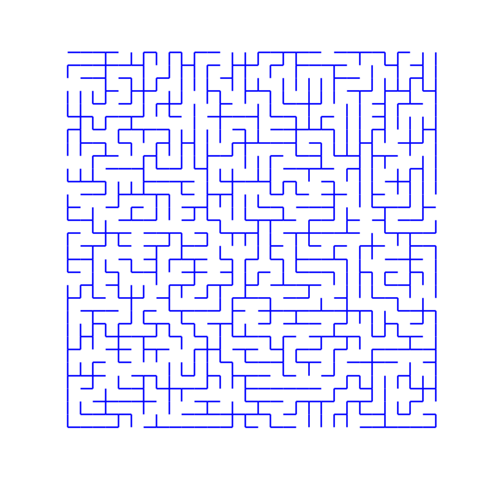
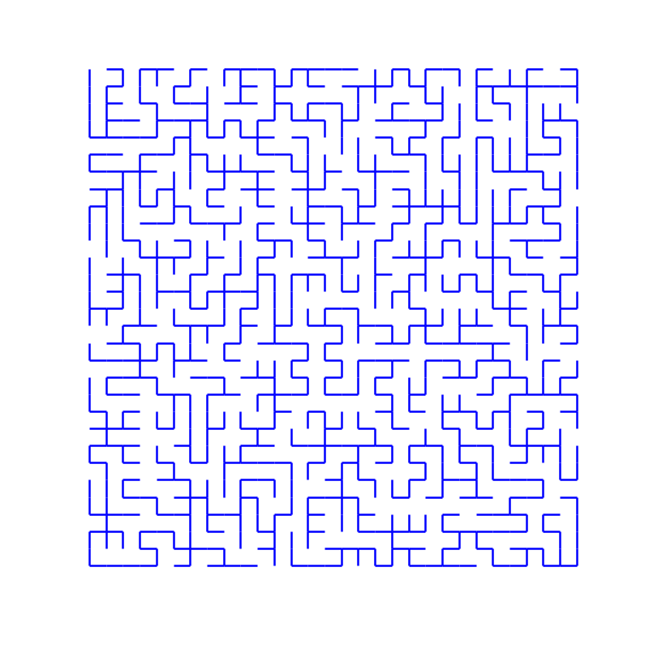
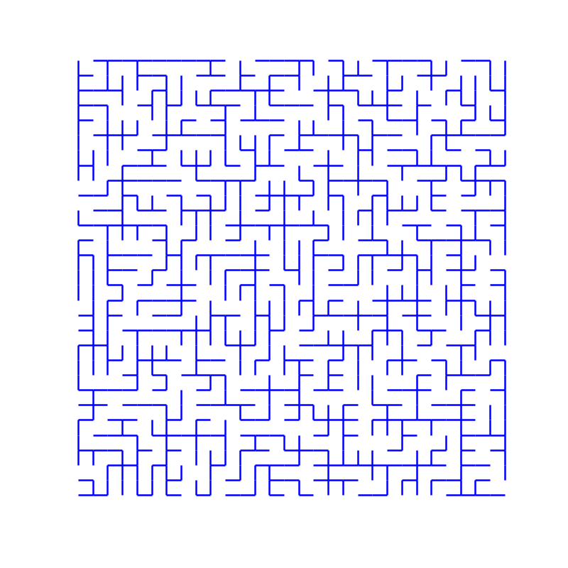
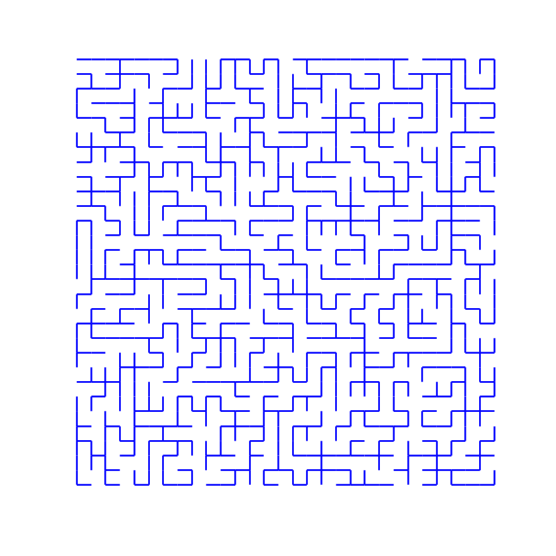
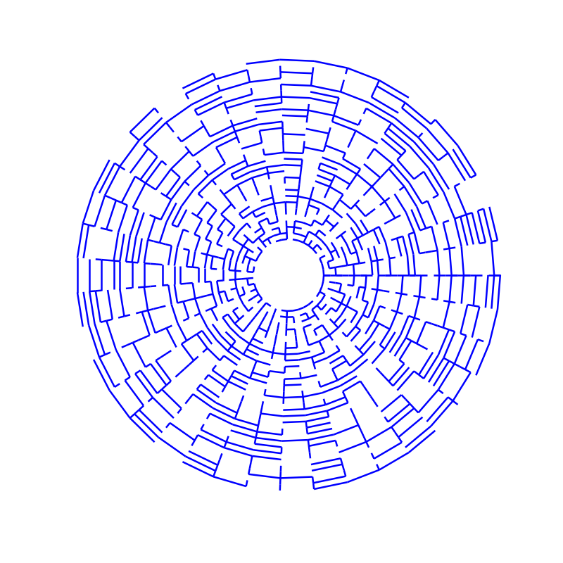

### Generating random mazes via Markov chain Monte Carlo sampling

This is a stochastic modeling project. We use a particular instance of the MCMC method, namely the Metropolis-Hastings algorithm, to sample spanning trees on a 2d rectangular grid (with or without a periodic boundary condition with respect to one of the dimensions) with a custom bias.

Note that explicit enumeration of the such trees in computationally unfeasible is general, since their number on a $m$-by-$n$ grid grows asymptotically as $exp\left(\frac{4\pi}{G}mn\right)$. 

The input to the Metropolis-Hastings algorithm is the energy functional governing the canonical ensemble that is being sampled. In our case, we take it to be
```math
\begin{align}
E(T) = \alpha \cdot {\text{diameter}}(T) &+ \gamma\cdot \#(\text{bends})
 + \sum_{i} \delta_i \cdot \#(\text{vertices of degree }i) \\
 &+ \sum_{j} \omega_j \cdot \text{winding number of $T$ around $v_j$}
\end{align}
```
where $T$ is a spanning tree and the coefficients $\alpha, \gamma, \delta_i, \omega_j$ are parameters that control the strength and direction of the bias for each term. A positive coefficient penalizes the corresponding property, while a negative one rewards it. In particular,
- larger $\alpha$ favors more isotropic configurations;
- smaller $\gamma$ leads to more jagged configurations;
- smaller $\delta_3, \delta_4$ favor branching;
- non-zero $\omega_j$ favors a winding pattern around a fixed vertex. This uses the Euclidean structure underlying the 2d grid. 

Below are some examples of the Metropolis-Hastings dynamics for various biases.

<div align="center">
  
  
</div>

<div align="center">
  
  
</div>

<div align="center">
  
</div>

### Structure
`sampling/` contains an implementation of the generic Metropolis-Hastings algorithm, and a definition a class for the state space we are particularly interested in. That being the space of trees spanning 2d grids.

`rendering/` handles visualization aspects. For a 2d grid with a periodic boundary condition on one of the axis, there is an option of rendering a spanning tree on a cylinder by means of a radial mapping.

See `main.py` for the main interface for running the simulation.

Requirements: 
`networkx`, `matplotlib`

### Further development
For larger grids performance becomes an issue.

### References
[1] https://en.wikipedia.org/wiki/Kirchhoff%27s_theorem

[2] Number of spanning trees in $n\times n$ grid, https://oeis.org/A007341
